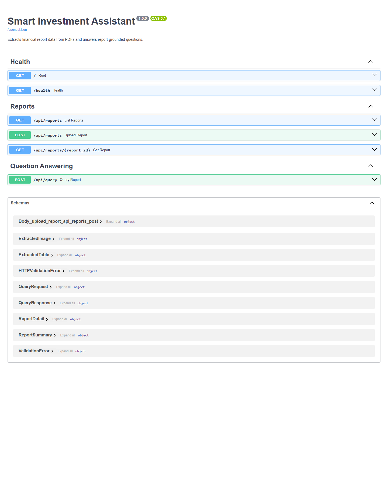
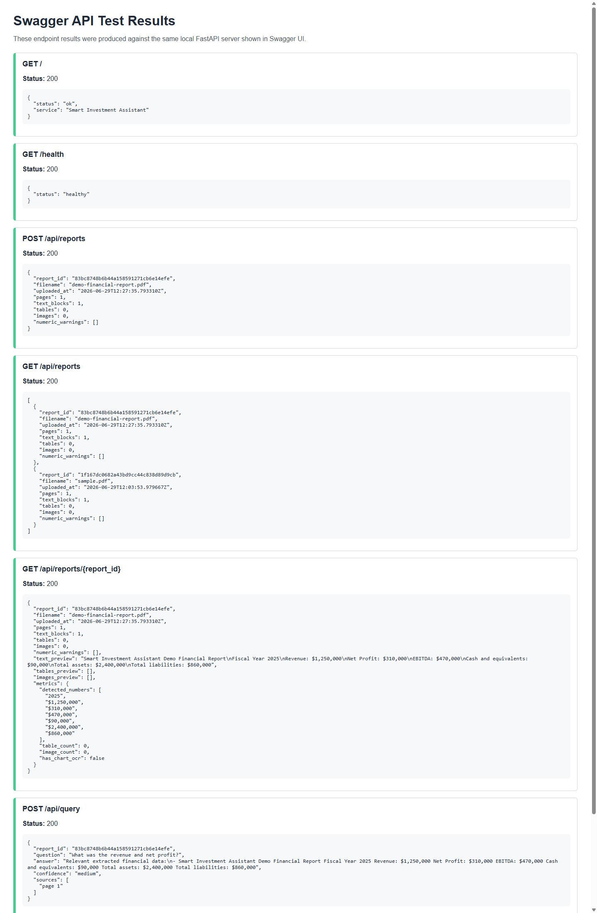

# Swagger Demo and API Test Evidence

This document records the tested API flow for the Smart Investment Assistant backend.

## Test Date

June 29, 2026 (initial run); endpoint list updated June 30, 2026 after adding the `/` dashboard UI and `/api/status` JSON health check.

## Environment

- Local API server: `http://127.0.0.1:8000`
- Swagger UI: `http://127.0.0.1:8000/docs`
- Test report: `docs/sample-report/aurora-capital-fy2025.pdf` (two-page financial report with a narrative summary, income statement table, and balance sheet table).

## Swagger UI

The screenshot below shows the FastAPI-generated Swagger documentation. Note: it was captured before the `/` route was changed to serve the HTML dashboard and `/api/status` was added as the JSON health check, so the endpoint list in `/docs` has since grown; the documented endpoints below reflect the current API.



## Tested API Flow

The following endpoints were tested one by one:

- `GET /` — HTML dashboard
- `GET /ui-testing` — HTML developer API console
- `GET /api/status` — JSON status check
- `GET /health` — JSON health check
- `POST /api/reports`
- `GET /api/reports`
- `GET /api/reports/{report_id}`
- `POST /api/query`
- `POST /api/reports` with an invalid text file to verify upload validation

The screenshot below shows the captured test results from the same local server used by Swagger UI.



The machine-readable results are also available in [`swagger-test-results.json`](swagger-test-results.json), and a human-readable HTML version in [`swagger-test-results.html`](swagger-test-results.html). Both were regenerated against the current route set with `python scripts/run_live_api_demo.py`.

## Result Summary

- `/` and `/ui-testing` returned `200` with HTML content.
- `/api/status` and `/health` returned `200` JSON.
- PDF upload returned `200` with a generated `report_id`.
- Report listing returned the uploaded report.
- Report detail returned extracted text and detected numeric values.
- Query endpoint returned a grounded answer referencing the report's revenue and net profit figures.
- Invalid upload returned `415`, confirming file type validation.

## Reproduce

Start the API:

```bash
uvicorn app.main:app --reload
```

Open Swagger:

```text
http://127.0.0.1:8000/docs
```

Run automated API tests:

```bash
pytest
```

Generate fresh live API evidence while the server is running:

```bash
python scripts/run_live_api_demo.py
```

